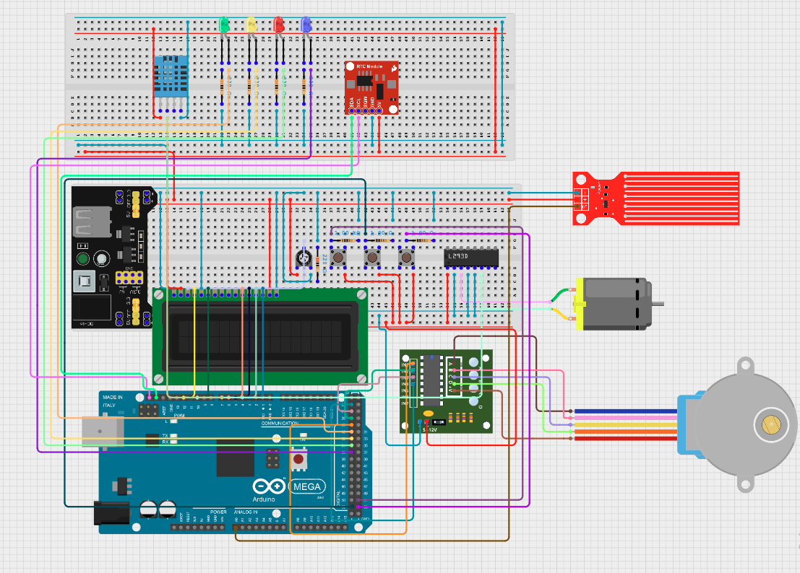
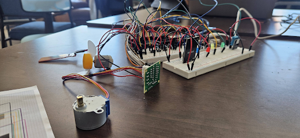
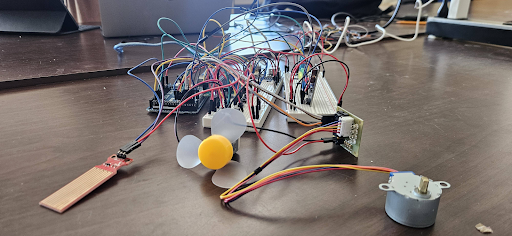
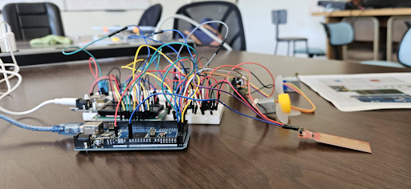
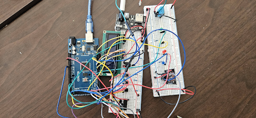
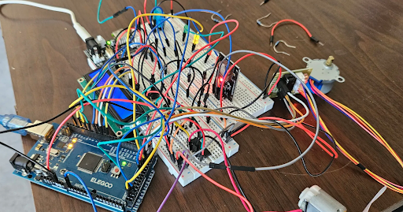
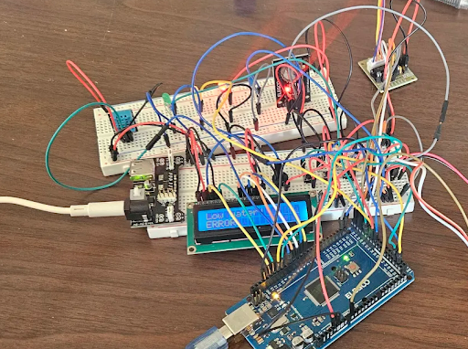
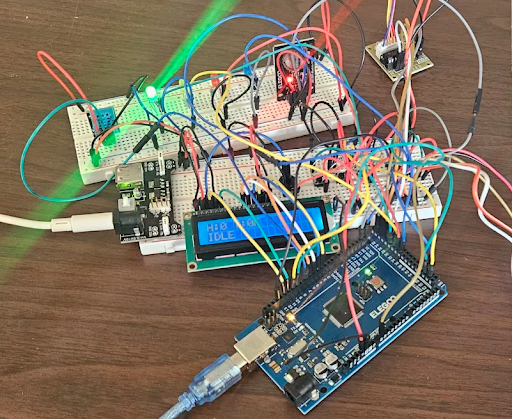
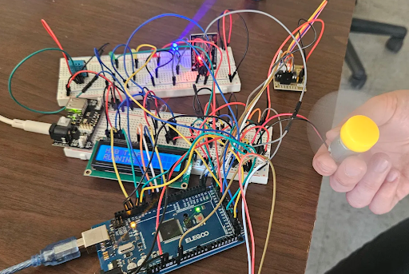

# Final Project Overview \- CPE 301

## Group 5: Edwin Cook, Austin Fredstrom, Anakin Guzzetta, Daniel Paschall

## May 9, 2025

# **Overview:**

	The goal of this final project was to design and implement an embedded environmental monitoring and response system using an Arduino Mega 2560 that functions as an evaporating water cooler. The system continuously monitors temperature, humidity, and water level, and dynamically responds to changing conditions by transitioning between pre-defined operational states. Based on these states, it activates a fan via an IC motor driver, controls a stepper motor-driven vent, and provides real-time feedback to the user through a 16x2 LCD display and onboard pushbuttons. It also logs every state transition with time stamped messages over UART, using a DS3231 real-time clock. This project demonstrates an integration of digital I/O, analog sensing, interrupt handling, and serial communication to form a reliable, autonomous control system.

# **Pin Mapping and Hardware Description:**

To enable full system functionality, a variety of sensors, actuators, and user interface components were interfaced with the Arduino Mega. The table and descriptions below outline the hardware components and their associated pin connections:

| Component | Datasheet Links | Description / Pin(s) |
| :---- | ----- | ----- |
| Arduino ATMega 2560 \[1\] | [https://www.alldatasheet.com/datasheet-pdf/view/107092/ATMEL/ATMEGA2560.html](https://www.alldatasheet.com/datasheet-pdf/view/107092/ATMEL/ATMEGA2560.html) | Microcontroller connected to components |
| 830 Tie-Points Breadboard \[2\] | [https://drive.google.com/file/d/1wuxNvisjWl\_tCd5R9foecoEm4tR4YVkF/view?usp=sharing](https://drive.google.com/file/d/1wuxNvisjWl_tCd5R9foecoEm4tR4YVkF/view?usp=sharing) | All components of the system are interconnected between the breadboard and the arduino |
| LCD Display (16x2) \[1\] | [https://components101.com/sites/default/files/component\_datasheet/16x2%20LCD%20Datasheet.pdf](https://components101.com/sites/default/files/component_datasheet/16x2%20LCD%20Datasheet.pdf) | Controlled via LiquidCrystal library in 4 bit mode **RS:** D12 | **EN:** D11 | **D4 \- D7**: D6 \- D3 |
| DHT11 Sensor \[1\] | [https://components101.com/sites/default/files/component\_datasheet/DHT11-Temperature-Sensor.pdf](https://components101.com/sites/default/files/component_datasheet/DHT11-Temperature-Sensor.pdf) | Digital Pin D7 (Temperature and Humidity) |
| Water Level Sensor \[1\] | [https://curtocircuito.com.br/datasheet/sensor/nivel\_de\_agua\_analogico.pdf](https://curtocircuito.com.br/datasheet/sensor/nivel_de_agua_analogico.pdf) | Analog Channel A0 (Threshold: 100\) |
| ULN2003 Stepper Motor Driver Module \[1\] | [https://components101.com/sites/default/files/component\_datasheet/28byj48-step-motor-datasheet.pdf](https://components101.com/sites/default/files/component_datasheet/28byj48-step-motor-datasheet.pdf) | Digital Pins D22, D24, D26, D28 (Stepper library, 2 RPM) |
| Fan Blade and 3-6V DC Motor \[1\] | [https://drive.google.com/file/d/1SYFzeOzTR1CTXmtkGFpmen8e6IW5VMVk/view?usp=sharing](https://drive.google.com/file/d/1SYFzeOzTR1CTXmtkGFpmen8e6IW5VMVk/view?usp=sharing) | Port B Pin 4 (PB4, bitmask 0x10) |
| RTC Module (DS3231) \[1\] | [https://www.alldatasheet.com/datasheet-pdf/view/254832/MAXIM/DS3231.html](https://www.alldatasheet.com/datasheet-pdf/view/254832/MAXIM/DS3231.html) | I2C Communication (for time stamping) |
| Buttons \[3\] | [https://components101.com/switches/push-button](https://components101.com/switches/push-button) | **Start**: PB3 (0x08) | **Reset:** PB2 (0x04) | **Vent Control:** PB1 (0x02) | Handled via **PCINT0** interrupts |
| LED Indicators \[4\] | [https://www.farnell.com/datasheets/67136.pdf](https://www.farnell.com/datasheets/67136.pdf) | **PC7:** GREEN (Idle) | **PC5:** YELLOW (Disabled) | **PC3:** RED (Error) | **PC1:** BLUE (Running) |
| 10k Potentiometer \[1\] | [https://components101.com/resistors/potentiometer](https://components101.com/resistors/potentiometer) | Adjusts LCD contrast | middle pin to LCD V0, ends to 5V & GND |
| 220 Ohm Resistor \[1\] | [https://drive.google.com/file/d/1ttotj-dO9qqWNcM4UznM68CCpBvK9A1L/view?usp=sharing](https://drive.google.com/file/d/1ttotj-dO9qqWNcM4UznM68CCpBvK9A1L/view?usp=sharing) | Used in series with LCD anode, pin A |
| 330 Ohm Resistor \[4\] | [https://drive.google.com/file/d/1ttotj-dO9qqWNcM4UznM68CCpBvK9A1L/view?usp=sharing](https://drive.google.com/file/d/1ttotj-dO9qqWNcM4UznM68CCpBvK9A1L/view?usp=sharing) | Used in series with the 4 LED Indicators |
| 1k Ohm Resistor \[3\] | [https://drive.google.com/file/d/1ttotj-dO9qqWNcM4UznM68CCpBvK9A1L/view?usp=sharing](https://drive.google.com/file/d/1ttotj-dO9qqWNcM4UznM68CCpBvK9A1L/view?usp=sharing) | Used for pull-downs on push buttons |
| L293D IC \[1\] | [https://www.alldatasheet.com/datasheet-pdf/view/22432/STMICROELECTRONICS/L293D.html](https://www.alldatasheet.com/datasheet-pdf/view/22432/STMICROELECTRONICS/L293D.html) | Used for Motor Driver of the Fan Blade and 3-6V DC Motor  |
| External 5V Power Supply \[1\] | [https://components101.com/modules/5v-mb102-breadboard-power-supply-module](https://components101.com/modules/5v-mb102-breadboard-power-supply-module) | Provides external 5V power source to motor and components via breadboard to offset Arduino power load |
| Jumper Wires | [https://drive.google.com/file/d/1ZzzVp6JeGzDPh1YnBoiFFOgF0rjolIep/view](https://drive.google.com/file/d/1ZzzVp6JeGzDPh1YnBoiFFOgF0rjolIep/view) | Used for general purpose of connection to signal and power circuit |

All peripheral configuration (direction, pull-up, activation) is done via memory-mapped register access, including direct ADC register manipulation for analog input. See Schematic and Figure 1-4 Physical Circuit References below for overview.

# 

# **Software Overview:**

	The embedded system operates using the ATmega2560 microcontroller, programmed in the Arduino IDE. The system is governed by a finite state machine consisting of four states: DISABLED, IDLE, RUNNING, and ERROR. Transitions between these states are triggered by sensor readings or critical events. Key components include:

* **Finite State Machine**  
  * The FSM controls transitions between these four states:  
    * **DISABLED:** System inactive. LED \= YELLOW.  
    * **IDLE:** System waiting. LED \= GREEN.  
    * **RUNNING:** Fan on, LCD shows sensor data. LED \= BLUE.  
    * **ERROR:** Triggered by low water level. LCD displays alert. LED \= RED.  
*  **State Transitions**  
  * From **IDLE → RUNNING**: If temperature \> 42°F (from DHT11).  
  * From **RUNNING → IDLE**: If temperature ≤ 42°F.  
  * From **ANY STATE → ERROR**: If water level \< 100 (analog A0).  
  * From **DISABLED → IDLE**: Triggered by user pressing **Start (PB3)**.  
  * From **ERROR → IDLE**: Triggered by user pressing **Reset (PB2)**.

* **Sensor Input**  
  * **Temperature & Humidity**: Read via DHT11 on D7 using readTemperature() and readHumidity() from the DHT.h library.  
  * **Water Level**: Analog read on A0 using ADC registers. If value \< 100, system triggers ERROR state.

* **Outputs and Actuation**  
  * **Fan**: Controlled by setting **bit 4 of PORTB** (PB4); active only in **RUNNING** state.  
  * **Stepper Motor (Vent Flap)**: Moves one step forward when **Vent Button (PB1)** is pressed. Controlled via Stepper library and logs action via **UART**.  
  * **LCD**:  
    * Controlled using LiquidCrystal in 4-bit mode.  
    * Normal: Shows humidity, temperature, and state.  
    * In ERROR: Displays “Low water\!” message.

* **User Interface**  
  * **Push Buttons** (PB1–PB3) use **pin change interrupts** (PCINT0).  
    * Start: PB3  
    * Reset: PB2  
    * Vent Control: PB1  
  * **LCD** provides real-time feedback based on system state  
  * **LEDs on PORTC** indicate the current FSM state using color codes.  
    * PC7 \= GREEN (Idle)  
    * PC5 \= YELLOW (Disabled)  
    * PC3 \= RED (Error)  
    * PC1 \= BLUE (Running)

* **Serial Communication (UART)**  
  * Baud Rate: **19200**  
  * On every **state change**, a log entry is sent via UART including:  
    * Previous state  
    * New state  
    * Timestamp (from DS3231)

**Schematic**
****

**Physical Circuit References** 

****

Figure 1 \- Physical Circuit Photo 1

****

Figure 2 \- Physical Circuit Photo 2

****

Figure 3 \- Physical Circuit Photo 3  

****

Figure 4 \- Physical Circuit Photo 4 

**System Operation References**

**DISABLED**  
**** 

**ERROR**  
**** 

**IDLE**  
**** 

**RUNNING**  
****  

GitHub Repository:

[https://github.com/anakin-g/CPE301-UNR-Final-Project](https://github.com/anakin-g/CPE301-UNR-Final-Project)

Video Demonstration:

[https://www.dropbox.com/scl/fi/ha8ox35ukd9tflzauu8qc/CPE301FinalProjectVideo.mp4?rlkey=gdgzngq47gelhmyeij92obs34\&e=1\&st=nv3fl5lw\&dl=0](https://www.dropbox.com/scl/fi/ha8ox35ukd9tflzauu8qc/CPE301FinalProjectVideo.mp4?rlkey=gdgzngq47gelhmyeij92obs34&e=1&st=nv3fl5lw&dl=0)  
